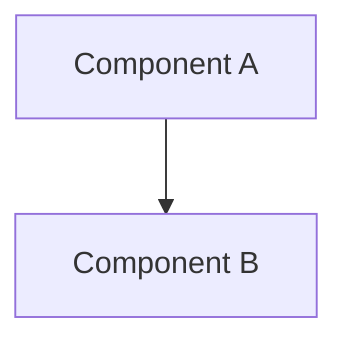

# Writing Plans

Turn an approved design into a minimal, self-sufficient, verifiable plan. This skill is the single source of truth for plan format: planners write to it, reviewers check against it, `executing-plans` runs it.

Design approval (from `brainstorming`) permits only this skill. Plan approval, obtained here, permits `executing-plans`.

## Principles

1. **Think before planning.** The approved design (Goal, Constraints, Success criteria, Assumptions) is the input. Carry its assumptions into the plan; do not re-decide the design. If the design has a gap or contradiction, stop and return to `brainstorming` instead of guessing. If a step has several readings, present them.
2. **Simplicity first.** Plan the fewest units and steps that meet the success criteria. No unrequested features, single-use abstractions, or speculative configurability. If the plan could be half as long, rewrite it.
3. **Surgical scope.** List only files the work requires and follow existing conventions. Record unrelated problems under `Risks` as notes, never as steps. Every `AffectedFiles` entry and step must trace to the Goal or an Acceptance item.
4. **Goal-driven.** Every Acceptance item is observable and covered by a `Verify` command with an expected result. Write tests first wherever behavior is testable.

## Workflow

1. Read the approved design; read code only to fill gaps.
2. Fix exact files, signatures, and types.
3. Group work into TaskUnits per the partitioning rules and draw the diagram.
4. Run the self-review checklist and fix issues inline.
5. Present for approval in the calling agent's checkpoint format (default: AffectedFiles table, one line per unit, 3-6 key changes). Nothing is saved yet.
6. Save the approved plan and hand off to `executing-plans`.

## Hard gate

- Write no code during planning. The only file ever written is the plan, and only after approval.
- Wait for explicit approval before saving and before any execution.
- No placeholders (`TODO`, `TBD`, "add validation later"). Every step carries explicit logic or commands.
- Every plan embeds a valid Mermaid diagram.
- Resolve `Open Questions` with the user before approval. A saved plan states `None`.
- Be self-sufficient: the executor will not rediscover scope. Use exact repo-relative paths and line ranges.

## Partitioning

- At most 5 TaskUnits; a small change may be one.
- Unit `Files` sets are disjoint, and every `AffectedFiles` entry belongs to exactly one unit.
- `DependsOn` is `none` or unit IDs, acyclic, used only for real ordering. Maximize units that can run in parallel.
- Every unit has a non-empty `Spec` and `Verify`; every file in `Files` appears in at least one step.
- No step touches a file outside its unit's `Files`.

## Step granularity

- 2-5 minutes each, independently testable.
- Name the exact file path, method signature with parameter and return types, and the logic.
- Write logic as precise prose or pseudocode (max ~15 lines). Full implementations are the executor's job.
- Test-first: failing test (name, inputs, expected result), then minimal logic, then verification.
- `Verify` lists exact commands with expected results, in the form `command -> expected`.

## Locations

- Plan: `local/agents/plans/YYYY-MM-DD-<feature-name>.md` (kebab-case)
- Fix plan (from a work review): `local/agents/plans/YYYY-MM-DD-<feature-name>-fix<N>.md`, containing only files that need changes
- Use repo-relative paths inside the plan.

## Template

The builder parses `Goal`, `AffectedFiles`, `TaskUnits`, `Spec`, `Verify`, `Acceptance`, and the unit fields `Files` and `DependsOn`. Never rename or omit them.

````markdown
# [Feature Name] Implementation Plan

## Goal
[One sentence]

## Scope
- In: [...]
- Out: [non-goals from the design]

## Architecture
[Approved approach in 2-4 lines]



## Assumptions
- [Carried from the approved design, marked as assumptions]

## User Review Required
> [!IMPORTANT]
> [Breaking changes, key decisions, risks needing approval, or "None"]

## Open Questions
None

## AffectedFiles
| File | Action | Why |
| :--- | :--- | :--- |
| `path/to/file` | NEW / MODIFY / DELETE | [reason tied to Goal or Acceptance] |

## Constraints
- [Limits the executor must respect]

## Conventions
- [Existing naming, style, patterns to follow]

## TaskUnits

### U1: [Component Name]
- **Files:** `path/to/file`, `path/to/other`
- **DependsOn:** none
- **Spec:**
  - [ ] **Step 1:** `path/to/file` (L10-40) - write failing test `name`: input -> expected
  - [ ] **Step 2:** `path/to/file` - implement `Type method(ParamType p)`: [logic]
  - [ ] **Step 3:** run verification and confirm PASS
- **Verify:** `command` -> [expected result]

## Acceptance
- [ ] [Observable, checkable criterion]

## Risks
- [Risk and mitigation; unrelated issues noticed, as notes only]
````

## Self-review

- No placeholders or ambiguous wording.
- Partitioning rules hold (disjoint files, acyclic `DependsOn`, at most 5 units).
- Every `AffectedFiles` entry has a step and traces to the Goal or an Acceptance item; no step leaves its unit's `Files`.
- Nothing exceeds the design's success criteria (simplicity check).
- Signatures and types match across units sharing an interface.
- Every Acceptance item is covered by at least one `Verify`.
- The diagram is valid and matches the units.
- `Open Questions` is `None`.

## Decision rules

| Condition | Action |
| :--- | :--- |
| Self-review finds ambiguity or placeholders | Fix inline before presenting |
| `Open Questions` not empty | Ask the user, merge answers, continue |
| Design gap or contradiction found | Stop, return to `brainstorming` |
| Independent review returns `CHANGES_REQUIRED` | Fix the draft, re-review |
| User approves | Save, reply with the path, hand off to `executing-plans` |
| User requests changes | Update the draft, request approval again |